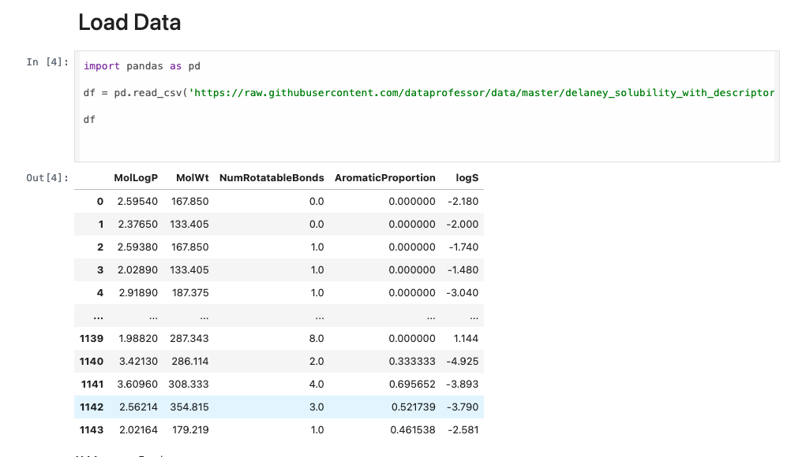
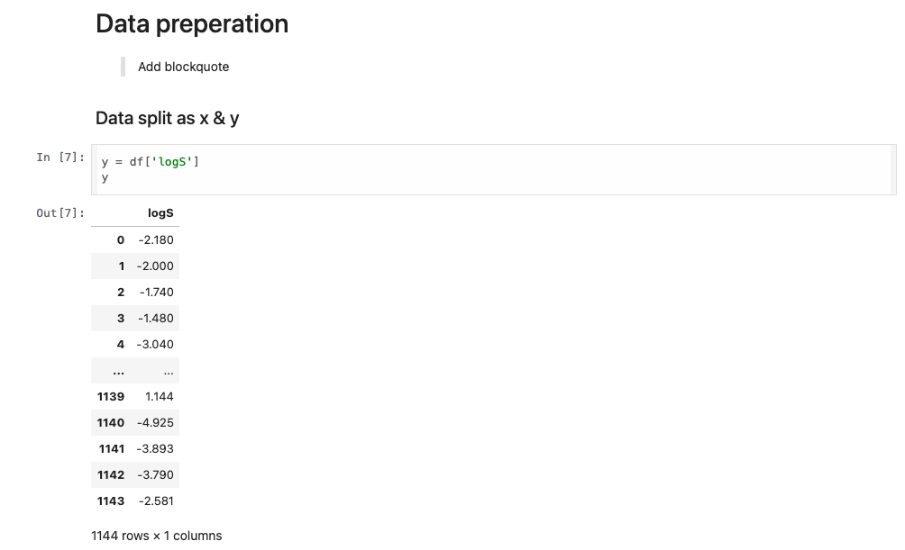
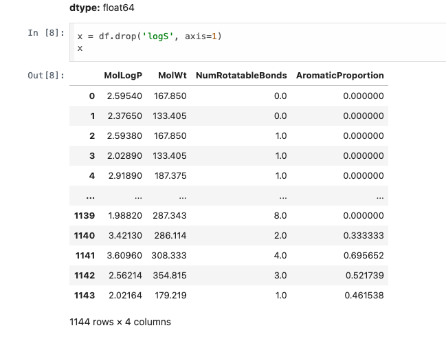
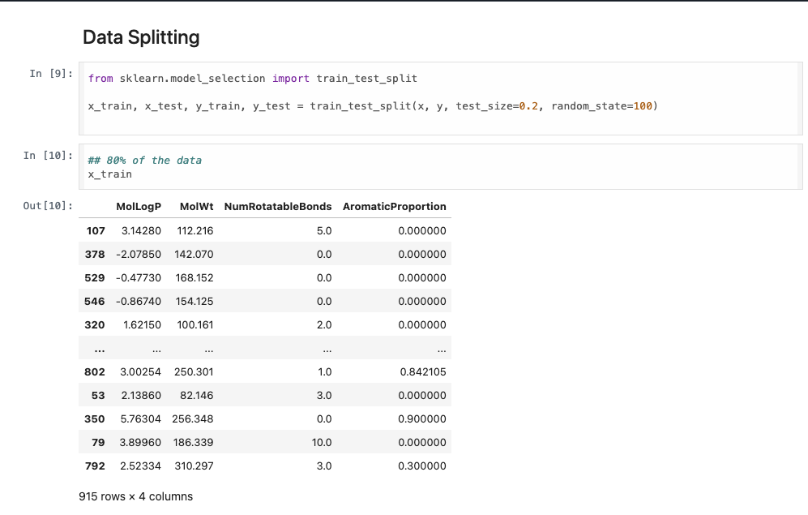
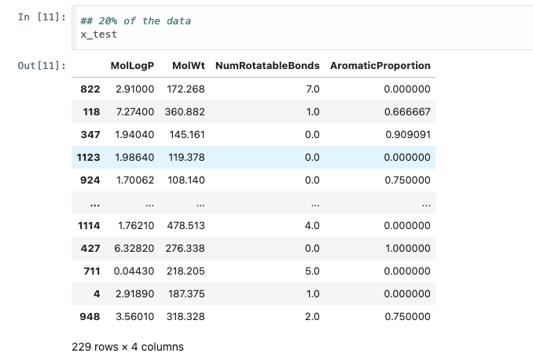
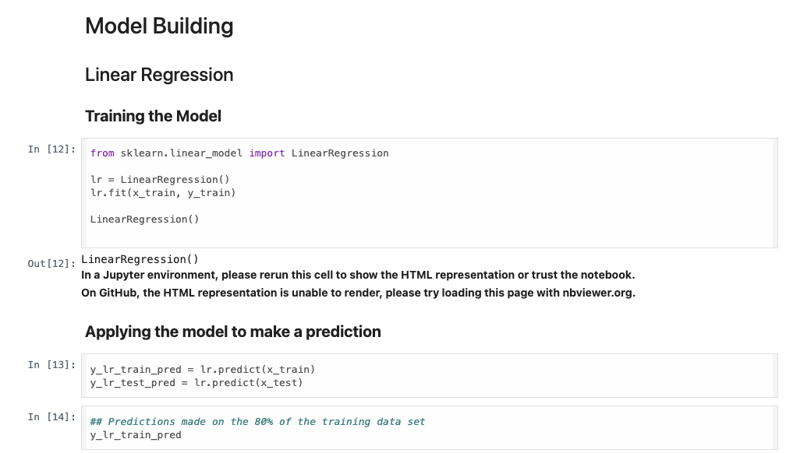

# ML-Project
Created and trained a linear regression model

## Loading The Data

## Prepping the data for analysis

## Splitting The test and training data

## Building a Linear Regression Model

